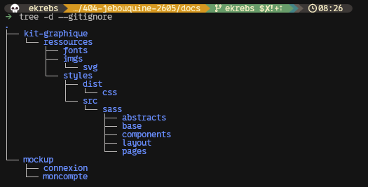
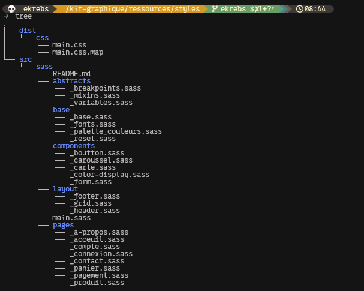
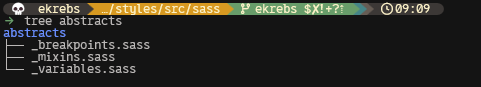
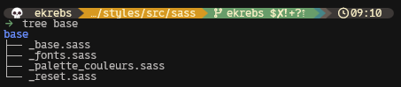
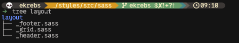
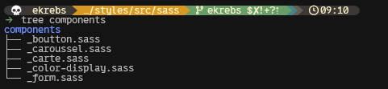
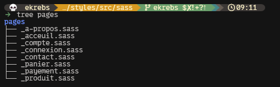

# le sass
> ___Sass ? c'est quoi, ça s'mange ? tu voulais dire sosis, non ?!___ 
>
> 

Le sass est un langage pour compiler ses fichiers en un seul fichier css.
Le sass peut compiler les `.sass`, `.scss` et `.css` en un seul fichier `css`.

### sert à:
- Découper son css en plusieurs fichiers et dossiers
  - pour meilleur organisation
  - afind d'éviter le fameux mono css "de la mort" qui fait 1500 lignes et est illisible par les collègues qui n'ont pas l'habitude de travailler avec 
  - réduit les collisions lorsque travail en équipe (git)
  - sass permet de compiler pour obtenir un seul fichier final css
- pouvoir donner plus de logique de code
  - pour moins se répéter.
  - la manière d'utiliser des variable donne moins de pulsions de mort qu'en css pur 

# la découpe sass
> ___ok, mais comment on découpe, chef ?___
> 

- exemple des dossiers d'un projet avec découpe sass:
  - le sass s'organise dans `styles/src/sass`
  - 
  

- exemple des fichiers sass dans les dossiers organisés:
  - le sass nous permet de construire les fichiers de `dist/css/` à partir des ressources dans `src/sass/`
  - 

- Les éléménets partiels en .sass sont signifiées avec un `_` en début de nom.
  - exemple: `_boutton.sass`
- Le `main.sass` sert à assembler tous les éléménts partiels .sass
## abstracts
> ___Comment fonctionne mon design ?___
>
> 
> 

### _breakpoints.sass
- centraliser les brakpoints du site ici.
  - les breakpoints sont en __min-width__

### _mixins.sass
- centraliser les mixins du site ici.

### _variables.sass
- centraliser les variables du site ici.

## base
> ___Quelles sont mes règles de base ?___
>
> 
>
### _base.sass
- une base de règles pour le site... exemple: utiliser les fonts...

### _fonts.sass
- les fonts utilisées.
  - seront transformées en variables dans `_variables.sass`

### _palette_couleurs.sass
- palette de couleurs "brute" à réutiliser dans `_variables.sass` pour les couleurs du site
  - c-a-d dans ma paellte "brute" je nomme mes couleurs
  -  dans `_variables.sass` ici on nous demande d'utiliser primary, secondary, accent ...

### _reset.sass
- nos reset de margin, padding, mettre le box-sizing par défaut...

## layout
> ___Comment ma page est-elle structurée ?___
> 
> 
>

- `_footer.sass` et `_header.sass` sont assez explicites...
  - on y définis le style particulier de leur élément.

### _grid.sass
- pour définir ici l'utilisation des grids

## components
> ___Quels sont les éléments réutilisatbles ?___
> 
> 
>
- on définis ici le style des "composants" (éléments réutilisables) du site
  - ex: _boutton.sass, _caroussel.sass, _carte.sass, _alert.sass, _form.sass, _input.sass
...

## pages
> ___Qu'est ce qui est spécifique à ma page ?___
> 
> 
>
- définis le style particulier des pages...

